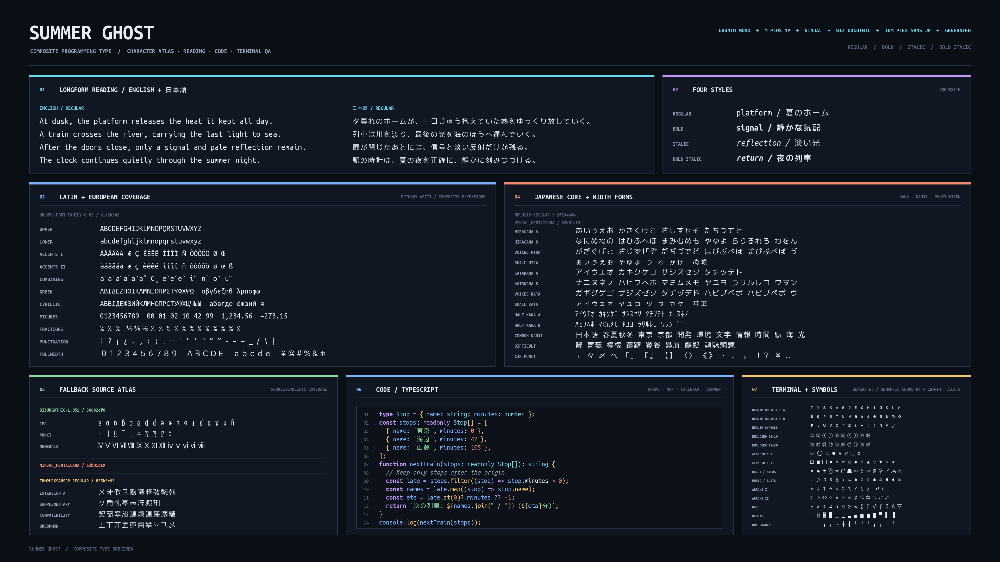

# Summer Ghost

A Japanese monospace font designed for Ghostty.

- Blends [Ubuntu Mono](https://design.ubuntu.com/font) for Latin characters with Japanese glyphs based on [Circle M+](https://itouhiro.github.io/mixfont-mplus-ipa/mplus/) and [BIZ UDGothic](https://github.com/googlefonts/morisawa-biz-ud-gothic), supplemented by [IBM Plex Sans JP](https://github.com/IBM/plex/tree/master/packages/plex-sans-jp).
- Feels like a natural Japanese extension of the Ubuntu font family while intentionally delegating [Nerd Fonts](https://www.nerdfonts.com/) icons to Ghostty's built-in fallback, keeping character widths and box-drawing glyphs predictable.



Latin and Japanese glyphs are balanced instead of being forced into the same bounding box:

- **Grid:** UPM 1024 with 512-unit half-width and 1024-unit full-width cells.
- **Optical scale:** Ubuntu Mono ASCII is 103% vertically and 100% horizontally; adjusted Cyroit Japanese remains at 100%; direct BIZ UDGothic and IBM Plex Sans JP fallbacks are scaled to 87% and 90%, respectively.
- **Line metrics:** Ascent 850, descent 174, and line gap 0 produce an exact 1-em line height while keeping Latin, kana, and kanji visually aligned.
- **Terminal symbols:** U+2460–U+2473 retain the complete IBM Plex Sans JP outlines with PlemolJP Console's familiar 67%-horizontal/90%-vertical enclosed-number proportions, recentered on the half-width cell. Basic arrows, the exact-mirror ⇐/⇒ pair, and an audited set of 24 common geometric, weather, phone, music, and temperature symbols stay inside that cell so Ghostty does not rescale them when neighboring cells change.
- **Terminal geometry:** Cyroit box drawing is grid-fitted across U+2500–U+257F, while solid Block Elements are generated on exact half-, quarter-, and eighth-cell boundaries. Ghostty 1.3.1 renders U+2500–U+259F with internal sprites by default; the font's own outlines are available through the optional override below.
- **Full-width space:** U+3000 intentionally has a visible four-corner marker as a coding aid, making otherwise blank cells easy to spot.

> [!NOTE]
> Ghostty 1.3.1 applies contextual fitting to symbol-like codepoints, including arrows and enclosed alphanumerics.
> For committed text, it [selects a one- or two-cell constraint from the neighboring cells](https://github.com/ghostty-org/ghostty/blob/v1.3.1/src/renderer/cell.zig#L251-L293); IME preedit text is [rendered through a separate unconstrained path](https://github.com/ghostty-org/ghostty/blob/v1.3.1/src/renderer/generic.zig#L3319-L3326).
> 
> The same character can therefore change apparent size when composition is confirmed or adjacent content changes.
> Ghostty does not currently expose a configuration option to disable this behavior.
> Summer Ghost keeps frequent symbols inside one cell where practical and gives U+2460–U+2473 PlemolJP-style elliptical outlines that remain legible when Ghostty fits them to one cell, but a font alone cannot make the two rendering paths identical.

## Installation

[uv](https://docs.astral.sh/uv/) is required. The first build downloads pinned upstream assets and verifies their SHA-256 digests.

```console
$ make install

download https://assets.ubuntu.com/v1/0cef8205-ubuntu-font-family-0.83.zip
download https://raw.githubusercontent.com/omonomo/Ubroit/v1.8.0/sourceFonts/Cyroit.nopatch/Cyroit-Regular.nopatch.ttf
download https://raw.githubusercontent.com/omonomo/Ubroit/v1.8.0/sourceFonts/Cyroit.nopatch/Cyroit-Bold.nopatch.ttf
download https://github.com/googlefonts/morisawa-biz-ud-gothic/releases/download/v1.051/BIZUDGothic.zip
download https://raw.githubusercontent.com/IBM/plex/ceee82fa88781b8310b198fd302480efaeac609e/packages/plex-sans-jp/fonts/complete/ttf/unhinted/IBMPlexSansJP-Regular.ttf
download https://raw.githubusercontent.com/IBM/plex/ceee82fa88781b8310b198fd302480efaeac609e/packages/plex-sans-jp/fonts/complete/ttf/unhinted/IBMPlexSansJP-Bold.ttf

=== Regular ===
wrote    SummerGhost-Regular.ttf: 16,713 codepoints, IBM fallback 3,637, UVS 9,689

=== Bold ===
wrote    SummerGhost-Bold.ttf: 16,713 codepoints, IBM fallback 3,637, UVS 9,689

=== Italic ===
wrote    SummerGhost-Italic.ttf: 16,713 codepoints, IBM fallback 3,637, UVS 9,689

=== BoldItalic ===
wrote    SummerGhost-BoldItalic.ttf: 16,713 codepoints, IBM fallback 3,637, UVS 9,689
wrote    dist/provenance.json
ok       SummerGhost-Regular.ttf: 16,713 codepoints, 16,811 glyphs, 6 selectors
ok       SummerGhost-Bold.ttf: 16,713 codepoints, 16,811 glyphs, 6 selectors
ok       SummerGhost-Italic.ttf: 16,713 codepoints, 16,816 glyphs, 6 selectors
ok       SummerGhost-BoldItalic.ttf: 16,713 codepoints, 16,816 glyphs, 6 selectors
validated Summer Ghost Regular/Bold/Italic/BoldItalic
Installed Summer Ghost into ~/Library/Fonts
```

Configure Ghostty to use the family:

```ini
font-family = Summer Ghost
```

Ghostty 1.3.1 uses internal sprites for U+2500–U+259F by default. Add this optional override only if you want Summer Ghost's own box/block outlines:

```ini
font-codepoint-map = U+2500-U+259F=Summer Ghost
```

Run `make help` to see the available commands and how to override the installation directory.

## License

Summer Ghost contains font software covered by the Ubuntu Font Licence 1.0 and the SIL Open Font License 1.1.
